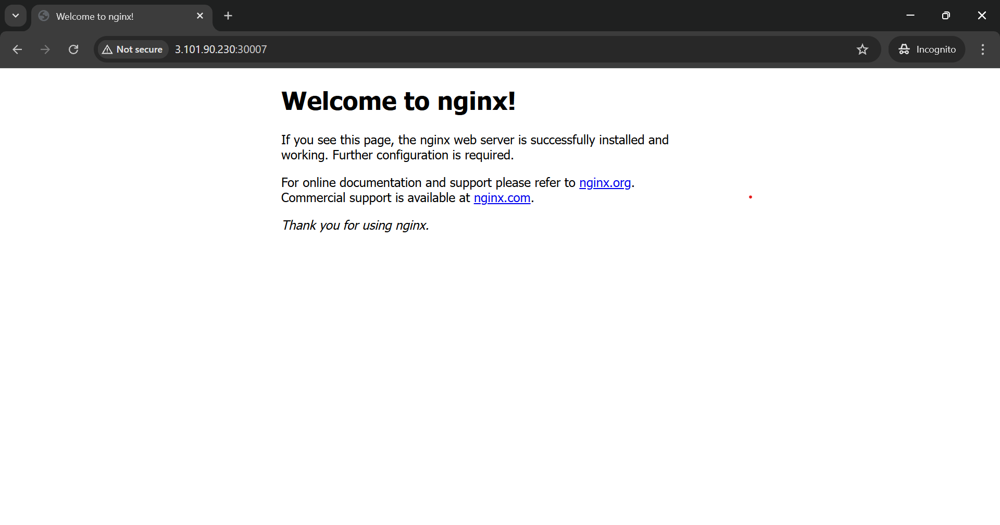

## Task - 1
### Q1 What is the smallest unit that kubernetes deploys?
- A.	Node
- B.	Pod
- C.	Service
- D.	Container

#### ANS : pod
---
### Q2 Which Kubernetes object is used to expose pods to network traffic?
- A.	Pod
- B.	Deployment 
- C. Service
- D. Namespace

#### ANS: Service
---
### Q3 Which Service type is used only for internal communication inside the cluster?
- A.	NodePort
- B.	LoadBalancer
- C.	ClusterIP
- D.	ExternalName

#### ANS: ClusterIP
---
### Q4 You want to access an application using <nodeIP>:<port> which Service type shoud you use?
- A.	ClusterIP
- B.	NodePort
- C.	LoadBalancer
- D.	Headless

#### ANS: NodePort
---
### Q5 Which service type is mainly used in cloude environments to expose applications externally?
- A.	ClusterIP
- B.	NodePort
- C.	LoadBalancer
- D.	ExternalName

#### ANS: LoadBalancer
---
### Q6 A pod is deleted accidentlly. which pod type can automatically recreate it?
- A.	Standalone Pod
- B.	Static Pod
- C.	Pod managed by Deployment
- D.	Init Pod

#### ANS: Pod managed by Deployment
---
### Q7 Which pod type is used to run Initialization task before yhe main container starts?
- A.	Sidecar Pod
- B.	Init Pod
- C.	Static Pod
- D.	Multi-container Pod

#### ANS: init pod
---
### Q8 containers inside the same pod communicate using:
- A.	Different IP addresses
- B.	Service only
- C.	Same IP address
- D.	External LoadBalancer

#### ANS: Same IP address
--- 
### Q9 Which Service assingns a stable internal ip address automatically?
- A.	NodePort
- B.	LoadBalancer
- C.	ClusterIP
- D.	ExternalName

#### ANS: ClusterIP
---
### Q10 you created a service ,but traffic is not reaching the pod .
### What is the most common reason?
- A.	Wrong image
- B.	Label mismatch
- C.	Pod crash
- D.	Node failure

#### ANS: Lable mismatch
---
###  Q11. Which Kubernetes component provides DNS-based service discovery?
- A.	kubelet
- B.	kube-proxy
- C.	CoreDNS
- D.	Scheduler

#### ANS: Core-DNS
---
### Q12 . You want a pod to always run on a specific node.Which pod type is used?
- A.	Init Pod
- B.	Sidecar Pod
- C.	Static Pod
- D.	Ephemeral Pod

#### ANS: Static pod
---
### Q13. Which Service type exposes a fixed port on every node?
- A.	ClusterIP
- B.	NodePort
- C.	LoadBalancer
- D.	ExternalName

#### ANS: NodePort
---
### Q14. You want pods inside the cluster to access an application using a DNS name. Which Service type should you use?
- A.	NodePort
- B.	LoadBalancer
- C.	ClusterIP
- D.	ExternalName

#### ANS: ClusterIp
---
### Q15. Which command shows the IP address of a pod?
- A.	kubectl get nodes
- B.	kubectl logs pod
- C.	kubectl get pods -o wide
- D.	kubectl describe service

#### ANS: Kubectl get pod -o wide
--- 
### Q16. You created a LoadBalancer Service in a local cluster.
- A.	External IP is assigned immediately
- B.	External IP stays pending
- C.	Pod is deleted
- D.	Service creation fails

#### ANS: External IP stays pending
---
### Q17. Which pod type is commonly used to support a main application with logging or monitoring?
- A. Init Pod
- B.	Standalone Pod
- C.	Sidecar Pod
- D.	Static Pod

#### ANS: sidecar pod
---
### Q18. Which Service field decides which pods receive traffic?
- A.	ports
- B.	type
- C.	selector
- D.	metadata

#### ANS: selector
---
### Q19. Which command is used to list all Services in a namespace?
- A.	kubectl get pods
- B.	kubectl get svc
- C.	kubectl describe pod
- D.	kubectl logs svc


#### ANS: kubectl get svc
---
### Q20. Two pods in the same namespace want to communicate.What is the recommended Kubernetes way?
- A.	Use pod IP directly
- B.	Use Service name
- C.	Use node IP
- D.	Use external IP

#### ANS: Use Service name
---
## Practical Assignment 
## K8s Task - 2
- You are given an application image that runs a web server. Perform the following steps:

1. Create a Deployment that runs the application with at least 2 pods.
2. Ensure all pods are created successfully and are in Running state.
3. Create a NodePort Service to expose the application.
4. Access the application from a browser using: http://NodeIP:NodePort
5. Verify that the application output is visible in the browser.
6. Take a screenshot of the browser output.
7. Create a README.md file and add: Deployment name Service type used URL used to access the application Screenshot of the browser output
8. Push the README.md file to a Git repository and submit the repository link.
---
### Deployment.yaml

```
piVersion: apps/v1
kind: Deployment
metadata:
  name: webapp-deployment
spec:
  replicas: 2
  selector:
    matchLabels:
      app: webapp
  template:
    metadata:
      labels:
        app: webapp
    spec:
      containers:
      - name: mycontainer
        image: nginx
        ports:
        - containerPort: 80
```
---
### Service.yml
```
apiVersion: v1
kind: Service
metadata:
  name: mysvc
spec:
  selector:
    app: webapp
  type: NodePort
  ports:
    - protocol: TCP
      port: 80       # Service port
      targetPort: 80  # Pod port
      nodePort: 30007 # NodePort

```
---
## OUTPUT


